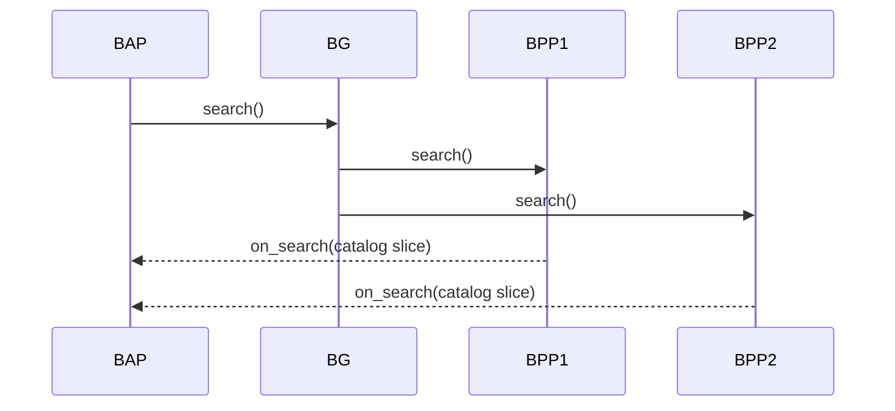
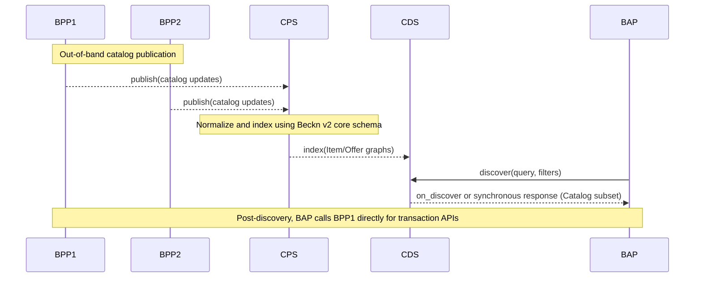

# Beckn Protocol Version 2

This repository contains the reference specification for Beckn Protocol Version 2 — defining a JSON-LD and schema.org-aligned core schema, a universal API envelope, and reference flows for the next generation of Beckn networks. It introduces a catalog-first **Catalog Discovery Service (CDS)** and **Catalog Publishing Service (CPS)** (replacing the Beckn Gateway), a [DeDi](https://dedi.global)-compliant Network Registry, and a modular "core + schema packs" model to enable strong design-time and run-time composability and global semantic interoperability.

This repository is intentionally kept **minimal and stable by design** — analogous to how HTTP defines a small, stable message envelope that underpins a vast ecosystem. Domain-agnostic transaction schemas and detailed type definitions are maintained in the [core_schema](https://github.com/beckn/core_schema) repository. Domain-specific schema packs are maintained in separate repositories per vertical.

> [!IMPORTANT]
> **v2.0.0-rc1 has reached End of Support.** The frozen snapshot of the specification as it existed during the RC1 phase is preserved on the [`core-2.0.0-rc1-eos`](https://github.com/beckn/protocol-specifications-v2/tree/core-2.0.0-rc1-eos) branch. Implementors who wish to continue working with or referencing the RC1 version can check out that branch. No further updates will be made to it.

---

## Version History

| Version | Status | Key Changes |
|---------|--------|-------------|
| **v2.0.0** | **LTS (Long Term Support)** | Universal `/beckn/{becknEndpoint}` endpoint (GET + POST), GET Body Mode and Query Mode, transport schemas inlined in `beckn.yaml`, non-repudiation types added (`CounterSignature`, `InReplyTo`, `LineageEntry`); JSON-LD alignment, CDS/CPS and DeDi protocol based Registry architecture introduced |
| v2.0.0-rc1 | **End of Support (EoS)** | Frozen on [`core-2.0.0-rc1-eos`](https://github.com/beckn/protocol-specifications-v2/tree/core-2.0.0-rc1-eos) branch — no further updates |
| v1.x | End of Support | Original Beckn protocol — OpenAPI/JSON Schema based, Beckn Gateway for discovery, bespoke registry APIs |

---

## Repository Structure

```
protocol-specifications-v2/
├── api/
│   └── v2.0.0/
│       ├── beckn.yaml          # OpenAPI 3.1.1 — Beckn Protocol API envelope v2.0.0 (LTS)
│       └── README.md
├── GOVERNANCE.md
├── LICENSE
└── README.md
```

> Transport-level schemas (`Context`, `RequestContainer`, `CallbackContainer`, `Signature`, `Ack`, `Nack`, etc.) are defined inline in `api/v2.0.0/beckn.yaml`. Domain-level schemas (`RequestAction`, `CallbackAction`, `Catalog`, `Item`, `Offer`, etc.) are published in the [**beckn/core_schema**](https://github.com/beckn/core_schema) repository. There is **no `schema/` directory** in this repository by design.

---

## Design Principles

### No Schema Folder — By Design

This repository deliberately contains **no `schema/` directory**. All transaction-level schemas — `Catalog`, `Contract`, `Intent`, `Fulfillment`, `Item`, `Provider`, and all action types (`DiscoverAction`, `ConfirmAction`, etc.) — are defined exclusively in the [**beckn/core_schema**](https://github.com/beckn/core_schema) repository and referenced via external `$ref` URIs at runtime. This repository owns the **transport contract only**. If a `schema/` folder appears anywhere in this repository, it is an error and should be removed.

### All API Fields Are Mandatory and Non-Negotiable

Every field defined within `beckn.yaml` is a mandatory part of the **protocol transport contract**. Fields such as `context`, `message`, `inReplyTo`, `status`, and `signature` MUST be present exactly as specified. Implementations MUST NOT redefine, alias, or override these fields using linked data mechanisms (e.g. rewiring field names or types via a JSON-LD `@context`). The container schema is fixed at the protocol level and is not subject to semantic extension or substitution. Linked data annotations — OWL definitions, JSON-LD `@context`, and vocabulary bindings — belong exclusively inside the `Message` payload as defined in `core_schema`.

### Container Schemas vs. Payload Schemas

The schemas in `beckn.yaml` are **container schemas**. They define the transport envelope, authentication contract, and message framing — nothing more. They carry no domain semantics. The `Message` object is intentionally an open container (`additionalProperties: true`) precisely because its contents — the actual transaction payload — are defined and governed by `core_schema`, not this repository. The separation is deliberate:

| Layer | Lives in | Purpose |
|-------|----------|---------|
| Transport envelope | This repo (`beckn.yaml`) | Mandatory, stable, version-locked |
| Transaction payload | `core_schema` | Domain-specific, evolvable, externally referenced |

### Transaction Schemas Are Kept External to Allow Independent Evolution

Domain-level schemas such as `Catalog`, `Contract`, `Fulfillment`, and all action schemas are expected to evolve continuously as new interaction domains emerge and existing ones mature. Keeping them in a separate repository (`core_schema`) means the **API envelope can maintain long-term stability** while the ecosystem schema layer evolves freely — new fields can be added to `Catalog`, new action types can be defined, and entirely new domains can be onboarded without requiring a version bump to this API spec.

---

## 1. High-level goals of v2

Beckn v2 reorganizes the protocol around:
- **Global semantic interoperability** via JSON-LD and deep alignment with schema.org and other globally interoperable linked data schemas.
- **Design-time composability**: minimal, stable core + pluggable domain-specific schema packs.
- **Run-time composability**: independent but interoperable actors (BAP, BPP, CPS, CDS, Registry) that can be recombined without changing the core.
- **Registry and discovery modernization**:
  - BG → CPS + CDS: Beckn Gateway is replaced by two specialized actors — a Catalog Publishing Service and a Catalog Discovery Service.
  - Legacy Registry → [DeDi](https://dedi.global)-compliant Registry: Network Registry becomes compliant with the Decentralized Directory (DeDi) protocol.
- **Long-term stability**: The base protocol is kept intentionally minimal — like HTTP — so that the specification itself rarely changes while the ecosystem built on top of it can evolve rapidly.

---

## 2. Schema changes: from v1 to v2

### 2.1 From OpenAPI/JSON Schema to JSON-LD + schema.org

#### v1.x
- API and data models primarily expressed as OpenAPI 3.x with embedded JSON Schema.
- Domain semantics encoded as ad-hoc JSON fields inside the Beckn message envelope.
- Limited machine-readable linkage to global vocabularies.

#### v2.0.x
- All core entities are JSON-LD graphs with:
  - `@context` — Beckn core context + domain contexts.
  - `@type` — Beckn and/or schema.org types (e.g. `beckn:Order`, `schema:Order`).
- Fields are explicitly mapped to schema.org wherever possible, with `beckn:` used for protocol-specific semantics.
- APIs are defined against these JSON-LD entities, not bespoke JSON blobs.

#### Benefits
- **Global semantic interoperability**: External ecosystems can consume Beckn data as generic JSON-LD / schema.org without custom adapters.
- **Forward compatibility**: New properties can be added in domain contexts without breaking core parsing.
- **Shared tooling**: Off-the-shelf semantic tools (RDF libraries, graph DBs, JSON-LD validators) become usable directly.

### 2.2 Schema distribution model

The v2 schema is distributed across three tiers:

| Tier | Repository | Contents |
|------|-----------|----------|
| **Protocol envelope** | This repo (`api/v2.0.0/beckn.yaml`) | Transport container schemas defined inline — `Context`, `RequestContainer`, `CallbackContainer`, `Signature`, `CounterSignature`, `Ack`, `Nack`, `InReplyTo`, `LineageEntry`, etc. Intentionally minimal for long-term stability. No `schema/` directory. |
| **Core transaction schema** | [`beckn/core_schema`](https://github.com/beckn/core_schema) | Domain-agnostic transaction schemas (`RequestAction`, `CallbackAction`, `Action`, `Catalog`, `Item`, `Offer`, `NetworkParticipant`, etc.) with full type definitions and JSON-LD annotations. |
| **Domain schema packs** | Per-vertical repositories | Use-case specific attribute packs with their own `@context`, `@type` definitions, examples, and validations. |

This tiered design means:
- **New industries → new schema packs**, not changes to the core.
- **The base protocol specification (this repo) rarely changes** — like HTTP, it defines a small, stable message envelope.
- Network policies decide which domain schema packs are required or permitted.

#### Design-time composability
- Core entities act as slots into which arbitrary domain vocabularies can be plugged.
- Multiple schema packs can co-exist for the same entity (e.g. "mobility + carbon accounting" for an `Item`).
- Networks can mandate a minimal schema set for interoperability and allow additional packs for richer bilateral integrations.

#### Run-time composability
- BAPs, BPPs, CPS, and CDS can inspect `@context`/`@type` at run-time to decide which schema they understand.
- Unknown schema can be safely ignored or passed through, keeping backward compatibility.

---

## 3. API changes

### 3.1 v2.0.0: Universal `/beckn/{becknEndpoint}` endpoint

v2.0.0 introduces a single universal endpoint that handles all Beckn protocol actions across all interaction domains:

```
GET  /beckn/{becknEndpoint}   — Body Mode or Query Mode
POST /beckn/{becknEndpoint}   — RequestContainer or CallbackContainer
```

The `{becknEndpoint}` path parameter follows the pattern `beckn/<action>` (e.g. `beckn/search`, `beckn/confirm`). Any Beckn Network Participant — BAP, BPP, CDS, CPS, or Registry — may implement this endpoint, selectively supporting the subset of actions relevant to their role.

#### GET — Body Mode

The action payload is sent as a JSON request body (`RequestContainer`); the Beckn Signature is transmitted in the `Authorization` header. Used for server-to-server interactions where the caller has a registered callback endpoint and expects an asynchronous callback in return.

```
GET /beckn/{becknEndpoint}
Authorization: Signature keyId="...",...
Content-Type: application/json

{ "context": {...}, "message": {...} }
```

#### GET — Query Mode

The action payload and signature are both expressed as URL query parameters, making the entire request a **self-contained URL**:

```
GET /beckn/{becknEndpoint}?Authorization={Signature}&RequestAction={RequestActionQuery}
```

Suitable for **QR codes**, **deep links**, **bookmarkable pages**, **frontend UIs**, **IoT/embedded clients**, and any context where the caller cannot send an HTTP request body. In Query Mode, the caller MUST NOT expect an asynchronous callback; the server acknowledges receipt with `Ack` (HTTP 200) only.

> **Body Mode and Query Mode are mutually exclusive.** If `Authorization` and `RequestAction` are present as query parameters, the request body MUST be absent and the `Authorization` header MUST be absent. If the request body is present, both query parameters MUST be absent.

#### POST

Handles both forward requests (`RequestContainer`) and asynchronous callbacks (`CallbackContainer`). The `{becknEndpoint}` path parameter determines the action. The `CallbackContainer` includes an `inReplyTo` field that cryptographically binds the callback to the originating request (see `CounterSignature` and `InReplyTo` schemas).

#### Authentication

All requests (except GET Query Mode) MUST carry a Beckn Signature in the `Authorization` header:

```
Authorization: Signature keyId="{subscriberId}|{keyId}|{algorithm}",algorithm="{algorithm}",created="{unixTs}",expires="{unixTs}",headers="(created) (expires) digest",signature="{base64Sig}"
```

Receivers validate the signature against the sender's public key resolved from the [DeDi](https://dedi.global)-compliant Registry using the `keyId` field.

#### Response semantics

| Code | Schema | Meaning |
|------|--------|---------|
| `200` | `Ack` | Receipt confirmed; signature valid; async callback will follow |
| `409` | `AckNoCallback` | Received but no callback due to a business constraint |
| `400` | `NackBadRequest` | Malformed or invalid request |
| `401` | `NackUnauthorized` | Invalid or missing authentication |
| `500` | `ServerError` | Internal error on the network participant's platform |

All transport schema types (`Context`, `RequestContainer`, `CallbackContainer`, `Signature`, `CounterSignature`, `InReplyTo`, `LineageEntry`, `Ack`, `Nack`, etc.) are defined inline in `api/v2.0.0/beckn.yaml`. Domain payload schemas (`RequestAction`, `CallbackAction`, `Catalog`, etc.) are in [`beckn/core_schema`](https://github.com/beckn/core_schema).

### 3.2 Discovery: BG multicast → CPS + CDS

#### v1.x: BG-mediated multicast catalog pull
In v1.x networks, Beckn Gateway (BG) primarily:
- Accepted `search` from BAPs.
- Performed multicast fan-out to all (or policy-filtered) BPPs.
- Received `on_search` callback responses back from BPPs to BAPs.

#### Workflow (v1.x)


#### v2.0.x: CPS + CDS replacing BG
In v2, BG is replaced by two specialized actors:
- **Catalog Publishing Service (CPS)**: accepts asynchronous catalog push publications from BPPs, normalizes and indexes catalog data.
- **Catalog Discovery Service (CDS)**: handles discovery queries from BAPs and returns aggregated catalog results.

Key differences from v1.x:
- Discovery is no longer BG multicast "pull" — each BPP asynchronously pushes catalog updates to CPS.
- BAPs query CDS for discovery; CDS resolves, aggregates, and returns results.
- BAPs reach BPPs directly only when initiating a post-discovery transaction flow.

#### Workflow (v2.0.x)


#### Benefits
- CPS and CDS can be deployed, scaled, and evolved independently.
- Rich indexing over standardized `Catalog` / `Item` / `Offer` graphs with network-configurable ranking, filtering, and personalization.
- Catalog dissemination happens continuously, independent of any specific BAP request.
- Discovery becomes a read-optimized lookup over the CDS index, not a real-time multicast workflow.

### 3.3 Network Registry: Beckn lookup/subscribe → DeDi-compliant registry

#### v1.x
- Network Registry exposed bespoke Beckn APIs for `lookup` and `subscribe`.
- Registry semantics were Beckn-specific and often tightly coupled to each network's implementation.

#### v2.0.x
- Network Registry is re-architected to be compliant with the **[Decentralized Directory (DeDi) protocol](https://dedi.global)**.
- The registry is now a public directory in DeDi terms: publicly accessible, machine-readable, exposed via standard HTTPS APIs.
- Beckn participant metadata (DID, endpoints, signing keys, capabilities, network membership) is modeled as DeDi directory records.
- Beckn clients perform DeDi lookups rather than bespoke Beckn `lookup`/`subscribe`.

#### Benefits
- Shared trust layer across ecosystems, not just Beckn.
- Easier multi-network composition: a BAP or BPP can discover participants via the same [DeDi](https://dedi.global)-compliant registry.
- Evolvable registry semantics: new attributes (e.g., compliance certifications, ESG scores) can be plugged into directory records without changing Beckn core.

---

## 4. Benefits of v2.0.x

### 4.1 Design-time composability
- **Minimal, stable core**: The base specification rarely changes. Domain evolution happens in schema packs and CDS/CPS configuration — not in this repo.
- **Domain schema packs**: New verticals (loans, climate, mobility, health) are added via separate JSON-LD contexts and Attributes models in their own repositories.
- **Configurable networks**: Network policies specify required/optional schema packs, allowed discovery strategies in CDS, and Registry namespaces.
- **Easier governance**: Core WG focuses on a small base schema + architectural constraints; Sectoral WGs create and maintain independent schema lists.

### 4.2 Run-time composability
- **Composable actors**: BAP, BPP, CPS, CDS, DeDi Registry, and auxiliary Agents (pricing, fulfillment, risk, etc.) can be deployed and evolved independently.
- **Graph-native data**: JSON-LD entities can be stored in graph databases and enriched with linked data from other ecosystems (identity, credentials, geospatial, ESG).
- **Progressive adoption**: Systems can implement a subset of the schema and flows while still interoperating at the core level.

### 4.3 Global semantic interoperability
- **Shared vocabularies**: Using schema.org as a base vocabulary dramatically reduces ambiguity across countries and industries.
- **Linked registries and catalogs**: [DeDi](https://dedi.global) provides a universal way to publish and verify public directories, including Beckn registries.
- **Machine-understandable contracts**: Orders, offers, prices, and terms are expressed in semantically rich JSON-LD, enabling automated reasoning, contract verification, and cross-network analytics.

---

## 5. Architectural prerequisites

To adopt v2.0.x, implementations should assume:

1. **JSON-LD support** — Ability to parse and validate JSON-LD; handling of `@context` resolution (either local or via controlled document loaders).
2. **schema.org-aware modeling** — Teams should be comfortable mapping business concepts to schema.org types/properties.
3. **CPS infrastructure** — A Catalog Publishing Service that accepts push-based catalog updates from BPPs and normalizes them using Beckn v2 core schema.
4. **CDS infrastructure** — A Catalog Discovery Service that indexes `Catalog` / `Item` / `Offer` graphs from CPS and exposes search/query APIs for BAPs.
5. **[DeDi](https://dedi.global)-compliant Registry** — A registry implementation that publishes Beckn participant records as DeDi directory entries and exposes DeDi APIs for lookups, queries, and verification.
6. **Network configuration & governance** — Clear policies for which schema packs are mandatory, how versions are managed, and how CPS, CDS, and Registry endpoints are bootstrapped and rotated.
7. **Security & trust** — Continued use of Beckn's digital signatures, non-repudiation guarantees, and transport security, aligned with [DeDi](https://dedi.global)'s trust and verification mechanisms.

---

## 6. Design considerations for implementers

### 6.1 Versioning & migration from v1.x
- Treat v2.0.x as a new line of the protocol, not an in-place upgrade.
- Plan separate:
  - **Registry migration**: map existing v1 participant records into [DeDi](https://dedi.global) directory records.
  - **Catalog migration**: convert v1 item models to v2 `Item` + `Offer` JSON-LD graphs with appropriate schema pack compositions.
- Maintain dual-stack in transitional phases: v1.x APIs and registry for production; v2.0.x APIs, CPS, CDS, and DeDi registry for pilots.

### 6.2 Network design-time choices
Define, per network:
- **Minimal core**: Core entities that must always be present (`Order`, `Provider`, `Location`, etc.).
- **Mandatory schema packs**: e.g., `mobility-core`, `retail-core`, `carbon-core`.
- **Optional enrichments**: Loyalty, ratings, ESG/green attributes, etc.
- **CDS configuration**: Ranking functions, filters, relevance scoring.
- **DeDi namespaces**: How network IDs, sectors, and jurisdictions are mapped to DeDi directory structures.

### 6.3 Runtime behavior & resilience
- **Asynchronous flows remain fundamental**: All transaction APIs are asynchronous, consistent with v1.x design.
- **Idempotency & replay safety**: Handle repeated publications and updates without side effects; use stable identifiers and timestamps to deduplicate.
- **Observability**: Introduce metrics and traces across BPP → CPS catalog publication, CPS → CDS indexing, CDS search, and DeDi registry lookups — crucial in multi-actor, multi-network deployments.

---

## 7. Scope & non-goals of v2.0.x
- No mandatory migration schedule defined.
- Focus on architecture, not policies: Network-specific policies (fees, SLAs, dispute resolution) are out of scope and remain network decisions layered on top of core.
- Specific action semantics (e.g. `search`, `select`, `init`, `confirm`) are defined in the [core_schema](https://github.com/beckn/core_schema) repo and domain-specific schema packs, not in this repository.

---

## 8. How to use this repository

Use this repo as the reference baseline for:
- **Understanding the Beckn v2 protocol envelope** — see `api/v2.0.0/beckn.yaml` for the universal API endpoint definition, transport schemas, and authentication contract.
- **Implementing Beckn v2.0.0-compatible network participants** (BAP, BPP, CPS, CDS, Registry).
- **Designing Beckn v2-compatible CPS and CDS implementations**.
- **Prototyping [DeDi](https://dedi.global)-backed Beckn registries**.

For domain-level schema types (`RequestAction`, `CallbackAction`, `Catalog`, `Item`, etc.), refer to [beckn/core_schema](https://github.com/beckn/core_schema).
For domain-specific schema packs, refer to the relevant vertical repositories.

### When contributing:
- Keep changes to this repository extremely conservative — this is the stable base protocol.
- Prefer contributing detailed schema evolution to [beckn/core_schema](https://github.com/beckn/core_schema) or domain-specific repositories.
- Ensure all additions maintain JSON-LD validity and schema.org alignment where possible.

---

## 9. Related resources

| Resource | Link |
|----------|------|
| Beckn Protocol v1 specification | https://github.com/beckn/protocol-specifications |
| Beckn core transaction schema | https://github.com/beckn/core_schema |
| Beckn schema registry | https://schema.beckn.io |
| DeDi protocol | https://dedi.global |
| Beckn website | https://beckn.io |

---

## 10. Issues & discussions

Visit the [Issues](../../issues) and [Discussions](../../discussions) board of this repository for queries, proposals, and community feedback.
